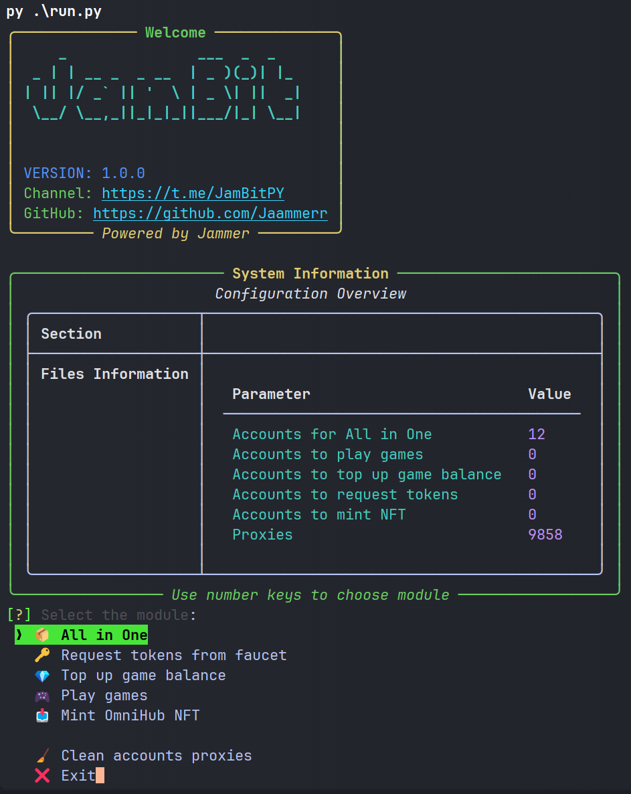

# 🌅 Irys Testnet Bot [v1.0.0]

  
  
  

    
    
  

---

## 💸 Free to Use

**Irys Bot** is completely free to use.  
No payments, no hidden fees — just download and start automating.

---

## 📘 Guides

> 🛠 **[Installation Guide](https://jammers-organization.gitbook.io/jambit/testnet/irys/gaid)**  
> 📖 **[User Guide – Getting Started](https://jammers-organization.gitbook.io/jambit/testnet/irys/ustanovka)**

Detailed step-by-step instructions to help you install and use **The Dawn Bot** effectively.

---

## 🧩 Modules

- All in One
- Request tokens from faucet
- Top up game balance
- Play games
- Mint OmniHub NFT
- Clean accounts proxies

---

## 💻 Requirements

- Python 3.11 or higher
- Stable internet connection
- Working proxies (HTTP)
- EVM wallets
- Balance for captcha solver (2Captcha, Anti-Captcha, etc.)

---